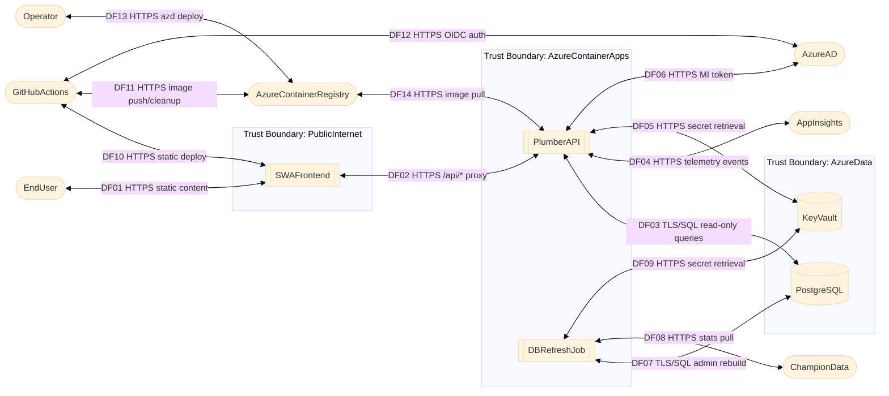

# Threat Model — netballstats

## Data Flow Diagram

---

## Element Table

| ID | Name | Kind | Boundary | Notes |
|---|---|---|---|---|
| C01 | EndUser | External Interactor | Outside | Browser user; unauthenticated |
| C02 | Operator | External Interactor | Outside | Admin via azd / Azure portal |
| C03 | GitHubActions | External Interactor | Outside | CI/CD; OIDC auth for AzureAD/ACR |
| C04 | SWAFrontend | Process | PublicInternet | Azure SWA; CDN-distributed; no server-side auth |
| C05 | PlumberAPI | Process | AzureContainerApps | R Plumber on ACA; read-only; public ingress; rate-limited |
| C06 | DBRefreshJob | Process | AzureContainerApps | Scheduled ACA job; admin DB access; runs superNetballR |
| C07 | PostgreSQL | Data Store | AzureData | Azure PostgreSQL Flexible Server; sslmode=require; public endpoint |
| C08 | KeyVault | Data Store | AzureData | Azure Key Vault; DB passwords; accessed via managed identity |
| C09 | AzureContainerRegistry | External Service | Outside | Basic SKU; no image signing; admin disabled |
| C10 | AppInsights | External Service | Outside | Telemetry workspace; connection string exposed via /meta |
| C11 | ChampionData | External Service | Outside | External stats API; consumed by DBRefreshJob |
| C12 | AzureAD | External Service | Outside | Managed identity provider; OIDC federated creds for GitHub Actions |

---

## Trust Boundary Table

| Boundary | Members | Network Exposure |
|---|---|---|
| PublicInternet | SWAFrontend | Port 443, external, no auth |
| AzureContainerApps | PlumberAPI, DBRefreshJob | Port 443 external (PlumberAPI); no listener (DBRefreshJob) |
| AzureData | PostgreSQL, KeyVault | PostgreSQL port 5432 with public endpoint + Azure Services firewall rule; KeyVault internal only |

---

## Data Flow Table

| ID | Source | Destination | Protocol | Description |
|---|---|---|---|---|
| DF01 | EndUser | SWAFrontend | HTTPS | Page load and static asset delivery |
| DF02 | SWAFrontend | PlumberAPI | HTTPS | SWA proxies all `/api/*` requests |
| DF03 | PlumberAPI | PostgreSQL | TLS/SQL | Parameterised read-only queries |
| DF04 | PlumberAPI | AppInsights | HTTPS | Sanitised telemetry event forwarding (includes client IP) |
| DF05 | PlumberAPI | KeyVault | HTTPS | API DB password retrieval via managed identity |
| DF06 | PlumberAPI | AzureAD | HTTPS | Managed identity token acquisition |
| DF07 | DBRefreshJob | PostgreSQL | TLS/SQL | Admin schema rebuild and data load |
| DF08 | DBRefreshJob | ChampionData | HTTPS | Weekly stats pull via superNetballR |
| DF09 | DBRefreshJob | KeyVault | HTTPS | Admin DB password retrieval via managed identity |
| DF10 | GitHubActions | SWAFrontend | HTTPS | Static site deployment |
| DF11 | GitHubActions | AzureContainerRegistry | HTTPS | Container image push and cleanup |
| DF12 | GitHubActions | AzureAD | HTTPS | OIDC federated credential exchange |
| DF13 | Operator | AzureContainerRegistry | HTTPS | Image management via azd/CLI |
| DF14 | AzureContainerRegistry | PlumberAPI | HTTPS | Container image pull at ACA deploy/restart |

---

## Post-DFD Gate

- Total component nodes: 12
- Trust boundaries: 3
- Threshold for mandatory summary DFD: > 15 nodes OR > 4 boundaries
- **Result: 12 nodes ≤ 15 and 3 boundaries ≤ 4 → Summary DFD NOT required**
